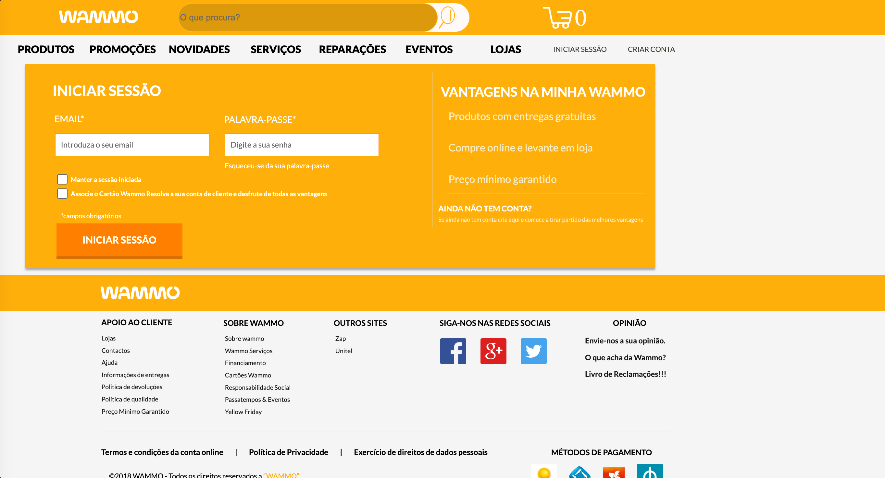
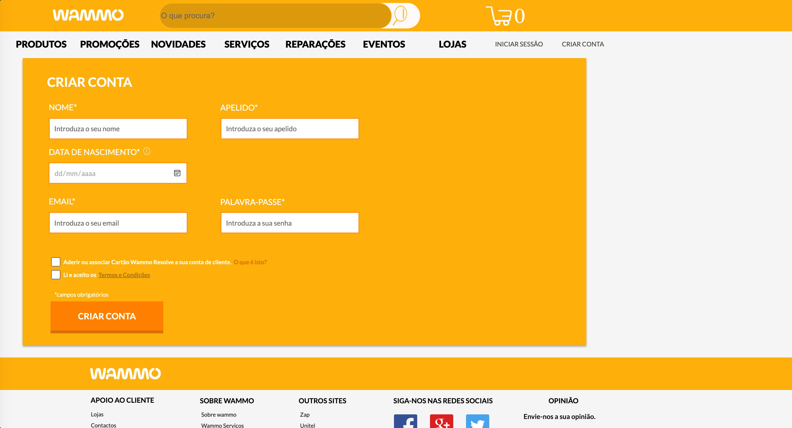
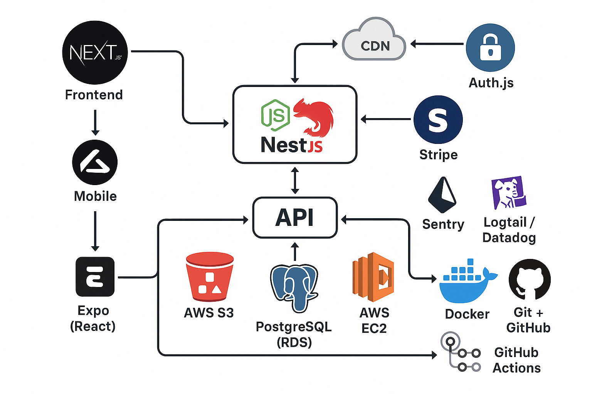

# Projeto Wammo!

Projeto antigo, iniciativa para um ecommerce para o Wammo! (2018)

Fiz várias telas sobre esse projeto mas nunca cheguei a documentar muito sobre ele, vou descrever algumas

## Tela sessão

A página sessao.html é voltada para o login de usuários no site da Wammo. Ela apresenta uma interface visual que mescla elementos de navegação, marketing e interação com o usuário.

Logo no topo, há um cabeçalho com a logo da marca, uma barra de busca e ícones representando funcionalidades como pesquisa e carrinho de compras. Um menu de navegação lista as principais categorias da loja, como produtos, promoções, serviços e eventos.

A seção central da página é dedicada ao formulário de login, permitindo ao usuário inserir seu e-mail e senha. Há opções adicionais como manter a sessão iniciada e associar um cartão da loja à conta. Ao lado do formulário, destaca-se um bloco com vantagens de se ter uma conta, como entregas gratuitas e preço mínimo garantido, incentivando o cadastro.

Na parte inferior, a página traz um rodapé informativo com diversas seções: apoio ao cliente, informações sobre a empresa, links para outros sites, redes sociais e uma área para opinião dos usuários. Também são exibidos os métodos de pagamento aceitos e os direitos legais da empresa.

No geral, trata-se de uma página de login promocional e funcional, que além de permitir o acesso à conta, reforça os benefícios da marca e fornece informações institucionais.

## Tela criar-conta

A página conta.html apresenta uma interface para criação de conta de usuário no site Wammo. Ela contém:

Cabeçalho com logotipo, campo de busca, ícones de carrinho e links para login e criação de conta.

Menu principal com categorias como Produtos, Promoções, Novidades, Serviços, Reparações, Eventos e Lojas.

Formulário de criação de conta que solicita:

* Nome e apelido

* Data de nascimento

* Email e palavra-passe

* Opção de aderir a um cartão da loja

* Confirmação de leitura dos Termos e Condições

* Um botão final de “Criar Conta”.

* Rodapé completo com informações institucionais, links de apoio ao cliente, redes sociais, opinião dos usuários, termos legais e métodos de pagamento.

A estrutura é voltada para oferecer uma experiência de cadastro clara, com destaque para identidade visual e informações adicionais da loja.

## 📦 Funcionalidades de um e-commerce completo

* Catálogo de produtos

* Categorias, filtros, busca (Elasticsearch)

* Carrinho e checkout

* Gerenciado com Redis + banco

* Sistema de pedidos e pagamentos

* Integração com Stripe ou Mercado Pago

* Autenticação de usuários

* JWT (para API), OAuth (login social), refresh tokens

* Área do cliente e painel admin

+ Sistema de cupons/descontos

* Avaliações, comentários, favoritos

* Logs, auditoria e monitoramento

* Email transacional (ex: compra feita, pedido enviado)

## 🧱 Desenvolvimento futuro

| Camada           | Tecnologia/Ferramenta       | Justificativa                                                                 |
|------------------|-----------------------------|-------------------------------------------------------------------------------|
| Frontend         | Next.js (React)             | SSR/SSG, SEO-friendly, ótimo para e-commerce, ideal para apps web e mobile   |
| Mobile           | Expo (React Native)         | Compartilha lógica com o Next.js, integra com API facilmente                 |
| Backend API      | Node.js + NestJS            | Estrutura escalável, modular, robusta para e-commerce                        |
| ORM              | Prisma                      | Tipagem forte, integra perfeitamente com PostgreSQL, DX excelente            |
| Banco de Dados   | PostgreSQL (RDS)            | Relacional, robusto, suporte a transações, ótima performance                 |
| Armazenamento    | AWS S3                      | Armazenar imagens, vídeos e documentos com segurança e alta disponibilidade |
| Backend Hosting  | AWS EC2 (ou ECS futuramente)| Controle total, flexibilidade para escalar                                   |
| Banco Hosting    | AWS RDS (PostgreSQL)        | Gerenciado, backup automático, alta disponibilidade                          |
| CDN              | Cloudflare ou AWS CloudFront| Cache, segurança, performance global                                         |
| Autenticação     | Auth.js (ex-next-auth)      | Suporte a OAuth, JWT, Magic Link, compatível com Next.js                    |
| Emails           | Resend ou AWS SES           | Envio de emails de verificação, compra, recuperação de senha                 |
| Pagamento        | Stripe                      | Rápida integração, confiável, suporte global                                 |
| Observabilidade  | Sentry + Logtail/Datadog    | Logs, erros e rastreamento completo do backend e frontend                    |
| Versionamento    | Git + GitHub                | CI/CD, pull requests, histórico                                               |
| Deploy CI/CD     | GitHub Actions              | Automação de testes, builds e deploys                                        |
| Containerização  | Docker                      | Facilita ambientes de desenvolvimento e produção                             |

## Arquitetura 

